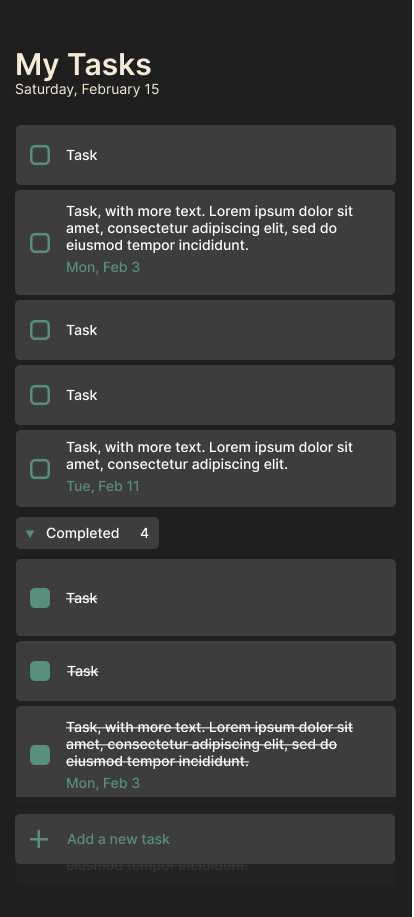
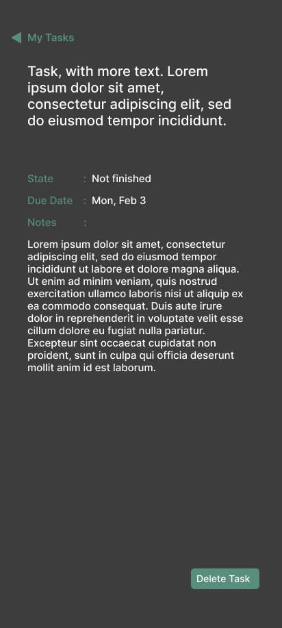

# 🎨 Diseño de interfaz de usuario - TaskFlow

TaskFlow es una aplicación de gestión de tareas con una interfaz amigable e intuitiva, diseñada para mejorar la productividad del usuario. Se ha basado en principios de diseño moderno con colores oscuros para reducir la fatiga visual. 🌙✨

A continuación, se presentan las principales pantallas de la aplicación:  

## 📝 Pantalla de Lista de Tareas

Cuando el usuario ingresa a la aplicación, verá una lista con las tareas pendientes y completadas organizadas por fecha. La interfaz permite:  

✅ **Marcar tareas como completadas.**  
📅 **Visualizar la fecha de vencimiento de cada tarea.**  
➕ **Agregar nuevas tareas de manera rápida.**  

  

---

## 🔍 Pantalla de Detalle de Tarea

Cuando el usuario selecciona una tarea, se muestra su información detallada, incluyendo:  

📌 **Estado de la tarea (pendiente o completada).**  
📆 **Fecha de vencimiento.**  
📝 **Notas adicionales proporcionadas por el usuario.**  
🗑️ **Botón para eliminar la tarea.**  

  

---

## 🎨 Paleta de Colores

La aplicación utiliza una combinación de colores oscuros con acentos en verde y gris, brindando una experiencia visual moderna y clara.  

🎨 **Colores principales:**  
- 🖤 **Fondo principal**: `#1F1F1F`  
- 🔤 **Texto principal**: `#FFFFFF`
- 🔳 **Títulos**: `#F5ECD5`
- ✅ **Color de acento**: `#578E7E`
- 🔳 **Botones y resaltados**: `#3D3D3D`

---

## 🔠 Fuentes y Estilo

- **Fuente principal**: Inter.  
- **Tamaño de fuente adaptable** para mejorar accesibilidad.  
- **Espaciado adecuado** para facilitar la lectura y la interacción.  

---

Este diseño busca ofrecer una experiencia fluida y eficiente para la gestión de tareas en dispositivos móviles. 📱🚀
